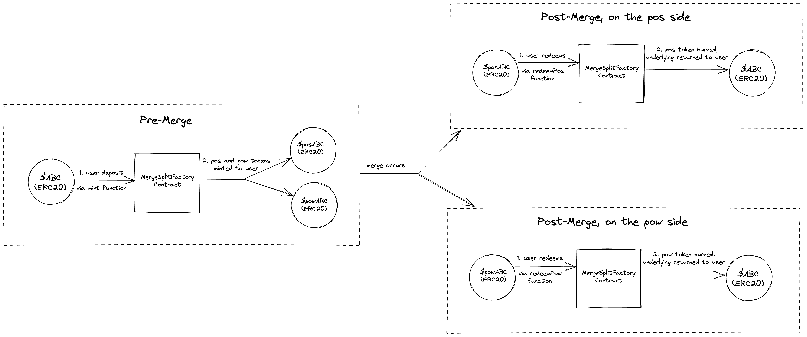

# Merge Split Tokens

## tldr

Lock up an asset and make a prediction on its value in a proof-of-stake or proof-of-work fork.

## Summary

[A](https://twitter.com/galois_capital/status/1555757029792309248) [lot](https://twitter.com/Galois_Capital/status/1553499131943043073) [has](https://twitter.com/Galois_Capital/status/1552716668526370816) been said about Ethereum's upcoming Merge, in particular about the implications of assets that will live on in both proof-of-work and proof-of-stake contexts.

These contracts are meant to create a way for someone to "split" their pre-merge asset into two proxy assets-- one that's redeemable on the proof-of-stake fork, and one that's redeemable on proof-of-work.

Have an opinion that a proof-of-work asset won't go to zero? Want to maximize exposure to the proof-of-stake version of an asset? Say no more.

NOTE: these contracts are unaudited and are risky to use. Play at your own risk. There is no canonical deployment, these contracts were written merely as an exercise.

## An Example

Alice has a strong opinion that an ERC20 $ABC will be worthless on any pow fork post-merge. Bob disagrees, and thinks $ABC on a pow fork would be worth more than half of $ABC on pos Ethereum, and that there will likely be a viable pow fork.

Alice and Bob can both deposit 100 $ABC and mint 100 $posABC and 100 $powABC tokens each. Alice can then trade Bob all 100 of her $powABC tokens for 50 of Bob's $posABC tokens. Alice gets to express that she thinks the pow versions of the tokens will be worthless, and Bob gets to buy cheap $ABC on the pow fork he believes will occur. Alice now has 150 $posABC and no $powABC, while Bob now has 200 $powABC and 50 $posABC.

Once the merge occurs, Alice can use her $posABC to claim the $ABC on pos Ethereum, at the cost of not being able to claim as many $ABC on the pow fork due to having sold those tokens. Bob can vice-versa use his extra $powABC to claim a $ABC on the pow fork, as well as claim his remaining $posABC on pos Ethereum.

## Implementation

### How To Mint

Using the `MergeSplitERC20Factory.mint` method, a user can deposit any amount of any ERC20-compatible token. In return, they'll receive the same amount of two ERC20s-- one representing the PoS claim, and one representing the PoW version. These proxy-assets can then be used in the same way normal ERC20s are used, aside from being redeemable for their underlying.

### How To Redeem

At any time, a user can burn equal parts of pow and pos assets to redeem a corresponding amount of the underlying, via `MergeSplitERC20Factory.redeemPair`.

After the contract identifies whether its on one particular fork or another (ie. post-merge), you'll also be able to claim with just the single asset corresponding to the environment you're on. If you're on the PoS fork, the contract will enable you to redeem your PoS asset for its underlying, and vice-versa for the PoW fork. These redemptions are done via the `redeemPos` and `redeemPow` methods.

### Wen Merge?

This setup is enabled due to the fact that we can check in-EVM whether the merge has occurred or not, in a few ways; both [EIP-3675](https://eips.ethereum.org/EIPS/eip-3675#replacing-difficulty-with-0) and [EIP-4399](https://eips.ethereum.org/EIPS/eip-4399#using-264-threshold-to-determine-pos-blocks) lay out potential methods. See [MergeChecker.sol](src/MergeChecker.sol) for more details on how this is implemented.

### Identifying You're On [PoW](https://ethereumpow.org/)

We can observe the `difficulty` changing on the proof-of-stake fork, but there isn't as easy of a change to observe for the proof-of-work fork. This makes it tricky to identify when the proof-of-work fork should be confident that the separate proof-of-stake fork has occurred, and that it can enable redemption of its pow-assets.

As a workaround, we can try the following methods:

1. Check the chain(id) - if the PoW fork wants to prevent replay attacks, it will need to change its `chainid`. There are no plans for the PoS chain to change its `chainid` from `1`, so we can optionally check if our contract observes a new `chainid`. If it's no longer `1`, then we must be on the PoW chain.
2. A timeout - if we expect the merge to occur in September 2022, we can assume that a fork which doesn't notice the merge (via the methods used in `MergeChecker`) given some buffer time beyond that is likely the PoW chain.

### Built With

- Inspiration from [inversebrah and frens](https://twitter.com/inversebrah/status/1556796071384612864)
- [Foundry](https://github.com/foundry-rs/foundry)
- Help from some friends: [gakonst](https://twitter.com/gakonst) for feedback on the idea, [t11s](https://twitter.com/transmissions11) for the optimizoor
